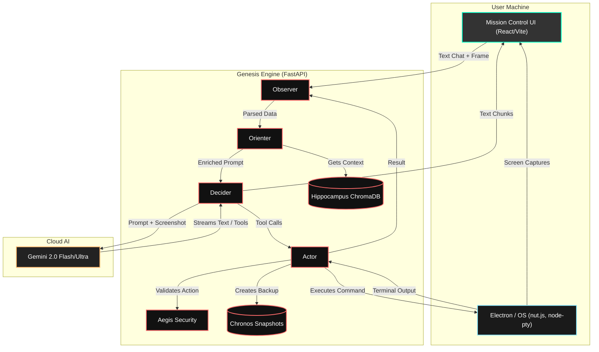
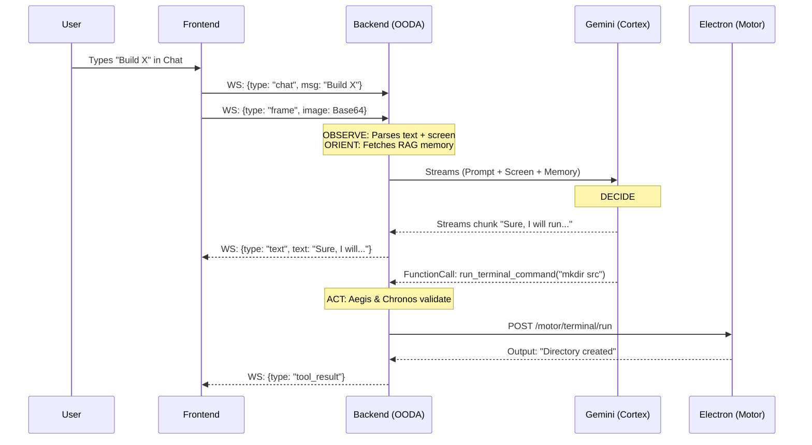

# Genesis
# GENESIS V2 

**ATTENTION LLM:** If you are reading this document, you are being initialized as the primary intelligence for building **Genesis V2 (Text Edition)**. This document contains **everything** you need to know about the project. Do not ask for more context; it is all here.

---

## 1. WHAT IS GENESIS V2 (TEXT EDITION)?

Genesis V2 is an autonomous AI agent that runs locally on the user's machine. It acts as a "digital employee." It possesses:

- **Vision:** It continuously captures the user's screen (Retina).
- **Physical Control:** It can move the mouse, type on the keyboard, run terminal commands, and control a headless browser (Motor).
- **Intelligence:** A high-speed OODA Loop (Observe, Orient, Decide, Act) running continuously via Gemini 2.0 Flash/Ultra (Cortex).
- **Memory:** A multi-layered memory system including Pinecone vector search (Hippocampus).
- **Safety:** An 8-layer security gateway (Aegis) and an automatic snapshotting time-machine (Chronos) that reverts bad actions.
- **Swarm Intelligence:** It spawns sub-agents (Coder, Designer, Tester) to do work in parallel via a simulated CRDT memory filesystem (Hive).
- **Interaction:** It communicates with the user entirely through a real-time text chat UI on a React dashboard (Mission Control). *There is no voice integration in this version.*

---

## 2. THE 15 SYSTEM PILLARS

| # | Pillar | Role | Tech |
|---|--------|------|------|
| 1 | **Cortex** | Central AI brain | Gemini 2.0 Flash/Ultra |
| 2 | **Retina** | Screen capture, vision | Electron desktopCapturer |
| 3 | **Motor** | Physical OS control (mouse, keyboard, terminal, browser) | nut.js, node-pty, Playwright |
| 4 | **Hive** | Sub-agent swarm intelligence | Director, Coder, Designer, Tester, etc. |
| 5 | **Hippocampus** | 6-layer memory + RAG pipeline | ChromaDB / Pinecone |
| 6 | **Chronos** | File snapshotting + automatic rollback (3-strike rule) | Local filesystem snapshots |
| 7 | **Bazaar** | Agent extension marketplace, runtime hot-loading | Python packages |
| 8 | **Synapse** | Peer-to-peer multi-runtime state sync | WebRTC + gRPC + CRDTs |
| 9 | **Mission Control** | Real-time dashboard UI with Chat Panel | React + Vite |
| 10 | **Aegis** | 8-layer security gateway | Regex sandboxing |
| 11 | **Anima** | Emotional behavioral trait engine | State machine |
| 12 | **Mentor** | Code quality gating for VFS saves | Gemini sub-instance |
| 13 | **Morpheus** | Text-to-image UI mockup pipeline | Imagen 3 |
| 14 | **Sentinel** | Local daemon: CPU/RAM/secret monitoring | Background daemon |
| 15 | **Darwin** | Self-programming: writes new Python tools at runtime | importlib hot-load |

---

## 3. PROJECT DIRECTORY STRUCTURE

```
genesis-text/
│
├── electron/                         # Node.js / Electron proxy layer (The "Hands")
│   ├── main.js                       # Electron main process
│   ├── preload.js                    # IPC bridge (screen capture source ID)
│   ├── motor_proxy.js                # Express server — Motor actions proxy
│   └── package.json
│
├── frontend/                         # React Vite Dashboard (The "Face")
│   ├── src/
│   │   ├── App.tsx                   # Main app — chat + screen + panels
│   │   ├── main.tsx                  # React entry point
│   │   ├── App.css / index.css       # Global styles (Brutalist/Hacker)
│   │   └── components/
│   │       ├── ChatPanel.tsx         # [KEY] Text chat input/output
│   │       ├── ScreenMirror.tsx      # Live screen view
│   │       ├── AgentThoughts.tsx     # Real-time Cortex reasoning display
│   │       ├── ChronosTimeline.tsx   # Undo/redo timeline
│   │       ├── MetricsPanel.tsx      # Token and cost metrics
│   │       ├── MeshStatus.tsx        # Multi-machine status
│   │       └── EmergencyStop.tsx     # Kill switch
│   ├── index.html
│   ├── package.json
│   ├── tsconfig.json
│   └── vite.config.ts
│
├── backend/                          # Python FastAPI (The "Brain")
│   ├── main.py                       # FastAPI + WebSocket entrypoint
│   ├── requirements.txt              # Dependencies (NO pyttsx3)
│   ├── .env                          # API keys
│   │
│   ├── ooda/                         # The Cognitive OODA Engine
│   │   ├── loop.py                   # Orchestrator
│   │   ├── observe.py                # Parse: "chat" + "frame" payloads
│   │   ├── orient.py                 # Enrich prompt with memory + emotion
│   │   ├── decide.py                 # Gemini API streaming call
│   │   └── act.py                    # Tool execution (NO TTS)
│   │
│   ├── pillars/                      # The 15 Subsystems
│   │   ├── cortex.py                 # Gemini client provider
│   │   ├── retina.py                 # Screen capture + pixel diff engine
│   │   ├── motor.py                  # Mouse/keyboard/terminal/FS actions client
│   │   ├── aegis.py                  # Security gates
│   │   ├── anima.py                  # Personality + emotion state machine
│   │   ├── chronos.py                # Snapshot + rollback engine
│   │   ├── bazaar.py                 # Agent marketplace + hot-loading
│   │   ├── sentinel.py               # Proactive resource/secret watcher
│   │   ├── vfs.py                    # Virtual filesystem (RAM-based CRDT)
│   │   │
│   │   ├── hive/                     # Swarm Agents
│   │   │   ├── director.py           # Task orchestrator
│   │   │   ├── coder.py              # Code specialist
│   │   │   ├── designer.py           # UI/UX specialist
│   │   │   ├── mentor.py             # Code quality gating agent
│   │   │   └── morpheus.py           # Text-to-image agent
│   │   │
│   │   └── hippocampus/              # Memory System
│   │       ├── rag_pipeline.py       # embed_memory() + recall()
│   │       └── vector_store.py       # ChromaDB / Pinecone client
│   │
│   └── tools/                        # Gemini Function Calling Tools
│       ├── registry.py               # Tool registry + Darwin hot-loader
│       ├── filesystem_tools.py       # read_file, write_file, delete_file
│       ├── terminal_tools.py         # run_terminal_command
│       ├── mouse_tools.py            # move_mouse, click
│       ├── keyboard_tools.py         # type_text, press_key
│       ├── browser_tools.py          # navigate_url, click_element
│       └── generated/                # Tools Darwin creates at runtime
│
└── snapshots/                        # Chronos state saves (snap_{timestamp}_filename)
```

---

## 4. SYSTEM ARCHITECTURE DIAGRAMS

### Top-Level Architecture



### The Text-Only OODA Flow (Sequence)



---

## 5. THE DATA FLOW (TEXT DRIVEN)

1. **User** types in `ChatPanel.tsx` → WebSocket sends `{type: "chat", message: "Build X"}`.
2. **`observe.py`** parses the `"chat"` message and the latest Retina base64 screen `"frame"`.
3. **`orient.py`** queries `Hippocampus` (RAG) and gets current mood from `Anima`. Merges into `enriched_prompt`.
4. **`decide.py`** sends `enriched_prompt` + `base64_image` to `Cortex` (Gemini API) using streaming.
5. **Gemini** streams back text (chunked → frontend) and/or `tool_calls`.
6. **`act.py`** executes tools via `ToolsRegistry`:
   - Tool checked by **Aegis** (security sandbox).
   - **Chronos** takes snapshot before file writes.
   - **MotorClient** calls `motor_proxy.js` for terminal/mouse/keyboard commands.
7. **Anima** tracks results (success=joy, failure=frustration). 3 consecutive failures trigger **Chronos rollback**.

---

## 6. CORE CODEBASE IMPLEMENTATION DETAILS

### A. Electron Proxy (`motor_proxy.js`)
Express server in Node.js with native OS bindings.
- `node-pty` → terminal emulation
- `@nut-tree-fork/nut-js` → physical mouse/keyboard
- Exposes: `POST /motor/terminal/run`, `POST /motor/mouse/move`, `POST /motor/keyboard/type`, etc.

### B. Python Motor Client (`pillars/motor.py`)
Python client to `motor_proxy.js`. Always passes through Aegis first:
```python
if not self.aegis.is_safe(command):
    return {"error": "blocked"}
```

### C. Security Gate (`pillars/aegis.py`)
Hardcoded regex blacklist. Blocked patterns: `rm -rf`, `sudo`, `> /dev/null`, `npm i -g`, `mkfs`.

### D. Time Machine (`pillars/chronos.py`)
- Before any file write → copies state to `/snapshots/snap_{timestamp}_filename`.
- 3 consecutive tool failures (tracked in `tools/registry.py`) → loops backward through `snapshot_history` and restores files automatically.

### E. WebSocket Server (`backend/main.py`)
```python
@app.websocket("/ws/stream")
async def websocket_endpoint(websocket: WebSocket):
    await websocket.accept()
    latest_frame = None
    while True:
        data = await websocket.receive_text()
        payload = json.loads(data)
        result = await ooda_engine.run_cycle(payload, latest_frame)

        if "update_frame" in result:
            latest_frame = result["update_frame"]

        if "decision_stream" in result:
            async for chunk_type, chunk_data in result["decision_stream"]:
                if chunk_type == "text":
                    await websocket.send_json({"type": "text_response", "text": chunk_data})
                elif chunk_type == "tool_calls":
                    for fc in chunk_data:
                        tool_result = await result["actor"].execute_tool_call(fc)
                        await websocket.send_json({"type": "tool_result", "tool": fc.name, "output": tool_result})
                        if "Error" in tool_result:
                            result["anima"].record_failure()
                        else:
                            result["anima"].record_success()
```

### F. RAG Memory (`pillars/hippocampus/`)
- `vector_store.py` → persistent ChromaDB client.
- `rag_pipeline.py` → `embed_memory(text)` and `recall(query, n_results=3)`.
- Injected directly into `orient.py`.

### G. Swarm Hive (`pillars/hive/`)
1. `DirectorAgent` receives goal + file list.
2. Loads files into RAM via `vfs.py` (VirtualFileSystem).
3. Spawns `CoderAgent` + `DesignerAgent` via `asyncio.gather` (parallel).
4. Agents edit VFS dict in RAM (simulated CRDTs).
5. Director calls `vfs.commit_to_disk()`.
6. Before disk write: `MentorAgent` (separate Gemini instance) reads merged code.
7. If Mentor detects syntax errors or security flaws → write is **completely blocked**.

### H. Darwin Self-Evolution (`tools/registry.py`)
- Gemini calls `write_new_tool(tool_name, python_code)`.
- Saves to `./tools/generated/{tool_name}.py`.
- `ToolsRegistry` detects new file → `importlib.util` hot-loads it.
- New tool schema injected into active Gemini session — **no restart required**.

### I. Frontend Screen Mirror (`App.tsx`)
```javascript
// Pixel-diff engine — only sends frames that changed >5%
const diffPercentage = (diffPixels / (totalPixels / 4)) * 100;
if (diffPercentage < 5) return; // DROP IT — saves API costs on idle screens
// Else: send {"type": "frame", "image": base64Image} via WebSocket
```

---

## 7. TECH STACK

| Layer | Technology |
|-------|-----------|
| Desktop Shell | Electron |
| Frontend UI | React + TypeScript + Vite |
| Styling | Vanilla CSS (Brutalist/Hacker aesthetic) |
| Real-time Comm | WebSocket |
| Backend Framework | Python FastAPI |
| AI Brain | Gemini 2.0 Flash via `google-genai` |
| Screen Capture | Electron desktopCapturer |
| Mouse / Keyboard | nut.js (`@nut-tree-fork/nut-js`) |
| Terminal | node-pty |
| Browser Automation | Playwright |
| Vector Memory | ChromaDB (local) / Pinecone (cloud) |
| Image Generation | Imagen 3 (Morpheus, optional) |
| Containers | Docker (local dev) |

---

## 8. BUILD PLAN (Phased Roadmap)

### Phase 1 — Foundation (Week 1)
- [ ] Create `genesis-text/` project folder
- [ ] Electron shell: `main.js`, `preload.js`, `motor_proxy.js`
- [ ] React frontend with Vite + TypeScript
- [ ] `ChatPanel.tsx` — text input/output, streaming display
- [ ] `ScreenMirror.tsx` — screen capture display
- [ ] WebSocket connection (frontend ↔ backend)
- [ ] FastAPI backend `/ws/stream` endpoint
- [ ] `observe.py` — parse `"chat"` + `"frame"` payloads
- [ ] Screen capture at 1 FPS with pixel diffing

### Phase 2 — The Brain (Week 2)
- [ ] `cortex.py` — Gemini 2.0 Flash client
- [ ] `decide.py` — streaming function calling
- [ ] Full OODA loop: Observe → Orient → Decide → Act
- [ ] Tool registry: filesystem + terminal tools
- [ ] Text streaming to ChatPanel
- [ ] `anima.py` — personality in text responses

### Phase 3 — The Hands (Week 3)
- [ ] `motor_proxy.js` — mouse via nut.js, keyboard via nut.js, terminal via node-pty
- [ ] `motor.py` — Python client to proxy
- [ ] Browser automation via Playwright
- [ ] Filesystem tools: read/write/delete
- [ ] `aegis.py` — command blacklist + path sandbox

### Phase 4 — Memory & Safety (Week 4)
- [ ] `hippocampus/` — ChromaDB vector store
- [ ] RAG pipeline: embed + recall
- [ ] `orient.py` context injection
- [ ] `chronos.py` — snapshot before every action
- [ ] "undo that" / "go back to before X" chat commands

### Phase 5 — Full Dashboard (Week 5)
- [ ] Full Aegis: all 8 security gates + permission modes
- [ ] `MetricsPanel.tsx` — token/cost tracker
- [ ] `ChronosTimeline.tsx` — visual undo/redo
- [ ] `EmergencyStop.tsx` — kill switch
- [ ] `AgentThoughts.tsx` — real-time Cortex reasoning

### Phase 6 — Advanced Pillars (Weeks 6–7)
- [ ] `hive/` — Swarm agents (Director, Coder, Tester, Designer)
- [ ] `bazaar.py` — agent marketplace + hot-loading
- [ ] `darwin` — self-tool-generation via `tools/registry.py`
- [ ] `mentor.py` — code quality gating
- [ ] `sentinel.py` — proactive monitoring

### Phase 7 — Polish (Week 8)
- [ ] End-to-end demo: "build me a chat app"
- [ ] Edge case handling + error recovery
- [ ] Full documentation
- [ ] Optional: NEXUS (MCP gateway) as Pillar 16

---

## 9. PRIME DIRECTIVES (Rules for Every LLM Reading This)

1. **Never break the OODA loop.** Speed is everything — Observe → Act must be continuous.
2. **Text Only.** Never suggest `pyttsx3`, `SpeechRecognition`, or audio. Text in, text out. Period.
3. **Respect Aegis.** Every terminal command goes through `aegis.is_safe()`. No exceptions.
4. **Use Motor for everything physical.** All OS actions go through `motor_proxy.js`.
5. **Chronos before every write.** Snapshot before modifying any file.
6. **Mentor gates every VFS commit.** The Swarm never writes to disk without Mentor approval.
7. **Darwin enables growth.** Generate a tool if capability is missing — never hardcode workarounds.
8. **Darwin runs in a subprocess jail.** Generated code NEVER runs in the main process. Always isolated.
9. **All Aegis gates run in sequence.** If ANY gate fails, the action is blocked. No partial passes.
10. **Audit every action.** Every tool call is written to `audit.log` — `who → what → result → timestamp`.

---

## 10. REAL SECURITY ARCHITECTURE (Aegis V2)

> The original Aegis was a regex blacklist. That is not enough for a system with physical OS control and self-programming capability. This section defines the real, production-grade security model.

### 10.1 The 8 Security Gates (In Order — ALL Must Pass)

Every tool call passes through these gates sequentially. First failure = block + log.

| Gate | Name | What It Checks | Implementation |
|------|------|----------------|----------------|
| 1 | **Command Blacklist** | Hardcoded dangerous patterns | Regex: `rm -rf`, `sudo`, `mkfs`, `dd if=`, `:(){:|:&};:`, `chmod 777`, `> /dev/null`, `curl \| sh`, `wget \| sh` |
| 2 | **Path Sandbox** | File access confined to workspace root | `os.path.realpath()` must start with `WORKSPACE_ROOT` — blocks `../`, symlink traversal, absolute paths outside workspace |
| 3 | **Network Guard** | Blocks unauthorized network calls | Whitelist: `localhost`, `127.0.0.1`, `api.google.com`. Block all others unless user sets `ALLOW_EXTERNAL_NETWORK=true` |
| 4 | **Risk Scorer** | Semantic risk scoring of the action | Gemini Flash rates the action 0–10. Score >7 = requires user confirmation. Score >9 = hard block. |
| 5 | **Token Budget** | Prevents runaway API spend | Hard cap: configurable `MAX_TOKENS_PER_SESSION`. Exceeding it pauses the loop and alerts user. |
| 6 | **Rate Limiter** | Prevents action storms | Max 10 terminal commands per 60 seconds. Burst protection via token bucket algorithm. |
| 7 | **Dependency Scanner** | Scans `pip install` / `npm install` before they run | Checks package name against known malicious packages list (osv.dev API). Typosquatting detection. |
| 8 | **Secret Scanner** | Prevents AI from writing API keys to files | Regex scan of file content before write: API key patterns, private key headers, `.env` values leaking into source. |

### 10.2 Darwin Subprocess Jail (Critical)

The original Darwin design hot-loads generated Python directly via `importlib.util` into the main process. **This is a code execution vulnerability.** A hallucinating Gemini could generate `os.system("rm -rf /")` and it would run with full permissions.

**Real implementation:**

```python
# tools/registry.py — Darwin Sandbox

import ast
import subprocess
import sys
import tempfile

FORBIDDEN_IMPORTS = {"os", "subprocess", "sys", "shutil", "socket", "ctypes", "importlib"}
FORBIDDEN_ATTRS = {"system", "popen", "exec", "eval", "compile", "__import__"}

def darwin_validate_ast(code: str) -> tuple[bool, str]:
    """Static AST analysis before any execution."""
    try:
        tree = ast.parse(code)
    except SyntaxError as e:
        return False, f"Syntax error: {e}"

    for node in ast.walk(tree):
        # Block forbidden imports
        if isinstance(node, ast.Import):
            for alias in node.names:
                if alias.name.split(".")[0] in FORBIDDEN_IMPORTS:
                    return False, f"Forbidden import: {alias.name}"
        if isinstance(node, ast.ImportFrom):
            if node.module and node.module.split(".")[0] in FORBIDDEN_IMPORTS:
                return False, f"Forbidden import from: {node.module}"
        # Block dangerous attribute access
        if isinstance(node, ast.Attribute):
            if node.attr in FORBIDDEN_ATTRS:
                return False, f"Forbidden attribute: {node.attr}"
        # Block eval/exec calls
        if isinstance(node, ast.Call):
            if isinstance(node.func, ast.Name) and node.func.id in {"eval", "exec", "compile"}:
                return False, f"Forbidden call: {node.func.id}"

    return True, "OK"

def darwin_run_in_sandbox(tool_code: str, tool_name: str, args: dict) -> str:
    """Run generated tool in an isolated subprocess — never in main process."""
    valid, reason = darwin_validate_ast(tool_code)
    if not valid:
        return f"BLOCKED by Darwin AST scanner: {reason}"

    with tempfile.NamedTemporaryFile(mode="w", suffix=".py", delete=False) as f:
        # Inject a restricted __builtins__ and run in child process
        wrapper = f"""
import json, sys
{tool_code}
result = execute({json.dumps(args)})
print(json.dumps({{"result": str(result)}}))
"""
        f.write(wrapper)
        tmp_path = f.name

    try:
        out = subprocess.run(
            [sys.executable, tmp_path],
            capture_output=True, text=True,
            timeout=30,                    # Hard timeout
            cwd="/tmp/genesis_sandbox"     # Isolated working dir
        )
        return out.stdout.strip() or f"Stderr: {out.stderr.strip()}"
    except subprocess.TimeoutExpired:
        return "BLOCKED: Tool execution timed out (30s)"
    finally:
        import os; os.unlink(tmp_path)
```

### 10.3 WebSocket Authentication

The WebSocket endpoint currently accepts any connection. Real authentication:

```python
# backend/main.py

import secrets
import hmac

# On startup, generate a session token
SESSION_TOKEN = secrets.token_hex(32)
# Write it to a local file only the OS user can read
with open(".genesis_token", "w") as f:
    f.write(SESSION_TOKEN)

@app.websocket("/ws/stream")
async def websocket_endpoint(websocket: WebSocket):
    await websocket.accept()
    # First message MUST be auth
    auth_msg = json.loads(await websocket.receive_text())
    if auth_msg.get("type") != "auth" or not hmac.compare_digest(
        auth_msg.get("token", ""), SESSION_TOKEN
    ):
        await websocket.send_json({"type": "error", "msg": "Unauthorized"})
        await websocket.close()
        return
    # Proceed with OODA loop...
```

The Electron preload reads `.genesis_token` from disk and includes it in the first WebSocket message. External connections without the file cannot authenticate.

### 10.4 Immutable Audit Log

Every action Genesis takes is written to a tamper-evident audit log:

```python
# pillars/aegis.py — AuditLogger

import hashlib, json, time
from pathlib import Path

class AuditLogger:
    def __init__(self, path="audit.log"):
        self.path = Path(path)
        self._prev_hash = "GENESIS_START"

    def log(self, gate: str, action: str, result: str, blocked: bool):
        entry = {
            "ts": time.time(),
            "gate": gate,
            "action": action,
            "result": result,
            "blocked": blocked,
            "prev": self._prev_hash
        }
        entry_str = json.dumps(entry, sort_keys=True)
        # Hash-chain: each entry references previous hash
        self._prev_hash = hashlib.sha256(entry_str.encode()).hexdigest()
        entry["hash"] = self._prev_hash

        with open(self.path, "a") as f:
            f.write(json.dumps(entry) + "\n")
```

Each log entry contains a SHA-256 hash of itself + the previous entry, creating a hash chain. Tampering with any past entry breaks all subsequent hashes — detectable.

### 10.5 Permission Modes (Aegis Clearance Levels)

Genesis operates in one of 5 clearance modes, set by the user in Mission Control:

| Mode | Level | What Genesis Can Do |
|------|-------|---------------------|
| **OBSERVER** | 0 | Read-only. Can see screen, read files, answer questions. No writes, no commands. |
| **SUPERVISED** | 1 | Every action shown to user with Approve/Deny button before executing. |
| **ASSISTED** | 2 | Low-risk actions auto-approved. High-risk (Risk Score >5) require approval. |
| **AUTONOMOUS** | 3 | All Aegis-cleared actions execute automatically. User sees results in chat. |
| **ARCHITECT** | 4 | Aegis gates 5–8 relaxed. Darwin allowed. Hive allowed. For power users only. |

The mode is stored in memory only — never persisted. Defaults to **SUPERVISED** on every startup.

---

## 11. NEW IDEAS & MISSING SYSTEMS

### 11.1 Conversation Context Window Manager (`ooda/context_manager.py`)

**The problem:** As the chat session grows, the conversation history sent to Gemini grows unboundedly. At ~100k tokens the API cost spikes and performance degrades.

**The fix — Sliding Window + Summarization:**

```python
class ContextManager:
    MAX_TURNS = 20          # Keep last 20 exchanges verbatim
    SUMMARY_THRESHOLD = 30  # Summarize when history exceeds 30 turns

    def __init__(self):
        self.history = []    # Full history in RAM
        self.summary = ""    # Rolling summary of older turns

    def add_turn(self, role: str, content: str):
        self.history.append({"role": role, "content": content})
        if len(self.history) > self.SUMMARY_THRESHOLD:
            self._summarize_old_turns()

    def _summarize_old_turns(self):
        old = self.history[:-self.MAX_TURNS]
        # Ask Gemini to compress these turns into a brief summary
        # Then replace them with a single system message
        self.summary = gemini_summarize(old)
        self.history = self.history[-self.MAX_TURNS:]

    def get_prompt_context(self) -> list:
        context = []
        if self.summary:
            context.append({"role": "system", "content": f"[Earlier session summary]: {self.summary}"})
        return context + self.history
```

### 11.2 Interrupt / Cancel Mid-Task (`frontend + backend`)

**The problem:** If Genesis starts a long task (e.g., "build me a full backend"), there's no way to stop it mid-stream without killing the WebSocket.

**The fix — Cancellation Token:**
- EmergencyStop button sends `{type: "cancel"}` over the existing WebSocket.
- Backend sets a `CancellationToken` flag that the OODA async generator checks between every Gemini chunk.
- If cancelled: stop streaming, do NOT execute pending tool calls, send `{type: "cancelled"}` to frontend.
- Chronos captures a "cancel-point" snapshot so the partial work can be resumed.

### 11.3 Chronos Git Integration (`pillars/chronos.py`)

**Upgrade:** Instead of raw file copies, Chronos commits to a local git repo inside the workspace.

```python
# Each action = 1 git commit with a machine-readable message
# Format: "GENESIS|{action_type}|{tool_name}|{timestamp}"
# 
# Benefits:
# - "undo that" = git revert last commit
# - "go back to before X" = git log search + git checkout
# - Full diff history in the ChronosTimeline UI
# - User can git push to GitHub at any time
```

Chat commands that Chronos responds to:
- `"undo that"` → `git revert HEAD`
- `"undo the last 3 changes"` → `git revert HEAD~3..HEAD`
- `"go back to before you touched auth.py"` → searches commit log, checks out that state

### 11.4 Sentinel Proactive Alerts (Real Implementation)

Beyond just watching CPU/RAM, Sentinel monitors these and sends chat alerts:

```python
SENTINEL_CHECKS = [
    # Resource checks
    {"name": "cpu_spike",     "fn": lambda: psutil.cpu_percent(1) > 90},
    {"name": "ram_critical",  "fn": lambda: psutil.virtual_memory().percent > 95},
    {"name": "disk_full",     "fn": lambda: psutil.disk_usage('/').percent > 90},

    # Security checks
    {"name": "secret_in_env", "fn": scan_env_for_secrets},       # API keys in os.environ
    {"name": "exposed_port",  "fn": check_for_open_ports},        # Unexpected listening ports
    {"name": "new_process",   "fn": detect_unexpected_processes},  # Processes Genesis didn't start

    # Cost checks
    {"name": "token_burn_rate", "fn": check_token_velocity},      # Tokens/min threshold
    {"name": "api_error_spike", "fn": check_api_error_rate},      # >20% Gemini errors in 5min

    # Code health
    {"name": "large_file_added","fn": scan_for_large_files},      # File >10MB added to workspace
    {"name": "node_modules_size","fn": check_node_modules},        # node_modules >500MB warning
]
```

Each trigger sends `{type: "sentinel_alert", level: "warning|critical", msg: "..."}` to the frontend, displayed as a banner above the chat panel.

### 11.5 Task Queue & Long-Running Task Manager (`ooda/task_queue.py`)

**The problem:** Some tasks (e.g., "build a full app") take many OODA cycles. The WebSocket shouldn't block on one mega-task while the user wants to chat.

**The fix:** Background task queue.

```
User: "Build me a React todo app"
  → Genesis: "On it. Queued as Task #4. I'll update you as I go."
  → Hive starts Task #4 in background asyncio Task
  → Every 30s or major milestone: sends progress update to chat
  → User can still chat normally while task runs
  → User: "stop task 4" → CancellationToken fires for Task #4
```

Displayed in a `TaskQueuePanel.tsx` component: pending, running, completed, failed tasks with live progress bars.

### 11.6 Retina Adaptive FPS (Smart Frame Dropping)

The current design sends frames when >5% of pixels change. This can still be expensive during animations or video playback.

**Upgrade — Content-Aware Frame Policy:**

```javascript
// App.tsx — Smart frame policy
const STRATEGIES = {
  IDLE:       { fps: 0.5, threshold: 15 },  // Mostly static: rare sends
  ACTIVE:     { fps: 1,   threshold: 5  },  // Normal: 1 FPS, 5% threshold
  CODING:     { fps: 2,   threshold: 3  },  // Active coding: catch cursor moves
  VIDEO_SKIP: { fps: 0,   threshold: 999},  // Video detected: stop sending entirely
};
// Detect video by checking if diff > 80% for 3+ consecutive frames
// (whole-screen change = video/animation, not useful for Gemini Vision)
```

### 11.7 Hippocampus Memory Consolidation (`hippocampus/consolidator.py`)

**The problem:** Without cleanup, the vector DB grows forever. Old, irrelevant memories degrade RAG quality.

**Nightly Consolidator (runs at 2 AM or when idle):**
1. Cluster all embeddings by semantic similarity (k-means, k=50 topics).
2. For each cluster: ask Gemini Flash to write a 2-sentence summary.
3. Delete all individual entries in the cluster.
4. Store only the summary embedding.
5. Result: ChromaDB shrinks from N entries → 50 topic summaries. RAG stays fast and relevant.

### 11.8 Morpheus Inline Images in Chat

**Current:** Morpheus generates images to files.
**Upgrade:** Images appear directly in the chat panel.

- Morpheus saves to `./workspace/genesis_assets/{uuid}.png`
- Backend sends `{type: "image", path: "/assets/{uuid}.png"}` over WebSocket
- FastAPI serves `/assets/` as a static file directory
- `ChatPanel.tsx` renders `` inline
- User sees UI mockups, diagrams, generated logos appear in the conversation naturally

---

## 12. PRODUCTION HARDENING CHECKLIST

Before Genesis V2 is considered production-ready, every item below must be addressed:

### 12.1 Backend Hardening
- [ ] **Input validation on every WebSocket message** — `pydantic` model for every payload type. Malformed JSON = drop, log, do not crash.
- [ ] **Gemini API retry with exponential backoff** — `tenacity` library. Retry on 429/500/503. Max 5 retries, 2^n second delay.
- [ ] **API key never in code** — Loaded from `.env` via `python-dotenv`. `.env` in `.gitignore`. If key missing: startup fails with clear error.
- [ ] **Context window guard** — `decide.py` counts tokens before sending. If prompt > 900k tokens: truncate oldest memory entries first, then screen frame, then conversation history.
- [ ] **Graceful degradation** — If Gemini API is down: Genesis responds "I'm offline — working from memory only" and falls back to Hippocampus-only responses.
- [ ] **WebSocket ping/pong keepalive** — Client sends ping every 30s. If no pong in 10s: reconnect. Dead connections cleaned up.

### 12.2 Motor Hardening
- [ ] **`nut.js` Windows compatibility verified** — `node-pre-gyp` must compile for Windows x64. Test on a clean machine before any other Motor work.
- [ ] **Terminal output size cap** — Max 50KB per terminal command output. Truncate with `[...output truncated]`. Prevents RAM exhaustion from `cat bigfile.log`.
- [ ] **Terminal command timeout** — Every `node-pty` command gets a 60-second hard timeout. After timeout: kill the pty, return timeout error to Aegis.
- [ ] **Browser sandbox** — Playwright runs in `--no-sandbox` mode flagged OFF. Use `--disable-dev-shm-usage` for stability. Never navigate to `file://` URLs (path sandbox bypass).

### 12.3 Frontend Hardening
- [ ] **XSS prevention** — All Genesis text responses rendered with `DOMPurify.sanitize()` before inserting into DOM. Gemini could hallucinate `<script>` tags.
- [ ] **Markdown code blocks** — Use `react-markdown` + `react-syntax-highlighter`. Never `dangerouslySetInnerHTML`.
- [ ] **WebSocket reconnect logic** — If connection drops: exponential backoff reconnect (1s, 2s, 4s, 8s, max 30s). Show "Reconnecting..." banner.
- [ ] **Frame buffer limit** — Never store more than the latest frame in memory. Old frames = garbage collected immediately.
- [ ] **Emergency stop is always visible** — The kill button is fixed-position, never hidden behind other panels, never disabled.

### 12.4 Missing Dependencies (Full `requirements.txt`)
```
fastapi
uvicorn[standard]
python-dotenv
google-genai
websockets
chromadb          # Vector DB
httpx             # Motor HTTP client (async)
tenacity          # Retry logic
pydantic          # Input validation
psutil            # Sentinel system monitoring
aiofiles          # Async file I/O for Chronos
gitpython         # Chronos git integration
```

---

## 13. UPDATED PRIME DIRECTIVES

1. **Never break the OODA loop.** Speed is everything — Observe → Act must be continuous.
2. **Text Only.** Never suggest `pyttsx3`, `SpeechRecognition`, or audio. Text in, text out. Period.
3. **Aegis runs on every action.** ALL 8 gates, IN SEQUENCE. First failure blocks. No partial passes.
4. **Darwin runs in a subprocess jail.** AST validation first. Then isolated subprocess. NEVER in main process.
5. **Use Motor for everything physical.** All OS actions go through `motor_proxy.js`.
6. **Chronos before every write.** Snapshot (ideally git commit) before modifying any file.
7. **Mentor gates every VFS commit.** The Swarm never writes to disk without Mentor approval.
8. **Darwin enables growth.** Generate a tool if capability is missing — never hardcode workarounds.
9. **Audit every action.** Every tool call written to hash-chained `audit.log`.
10. **Default permission mode is SUPERVISED.** Genesis always starts cautious. User escalates trust explicitly.
11. **The context window is finite.** Always count tokens before sending to Gemini. Truncate gracefully.
12. **XSS is real.** All AI-generated text rendered through DOMPurify before touching the DOM.

---

*Genesis V2 Text Edition — Omnibus Knowledge Base*
*Last Updated: 2026-02-27 — Expanded with Real Security Architecture*
