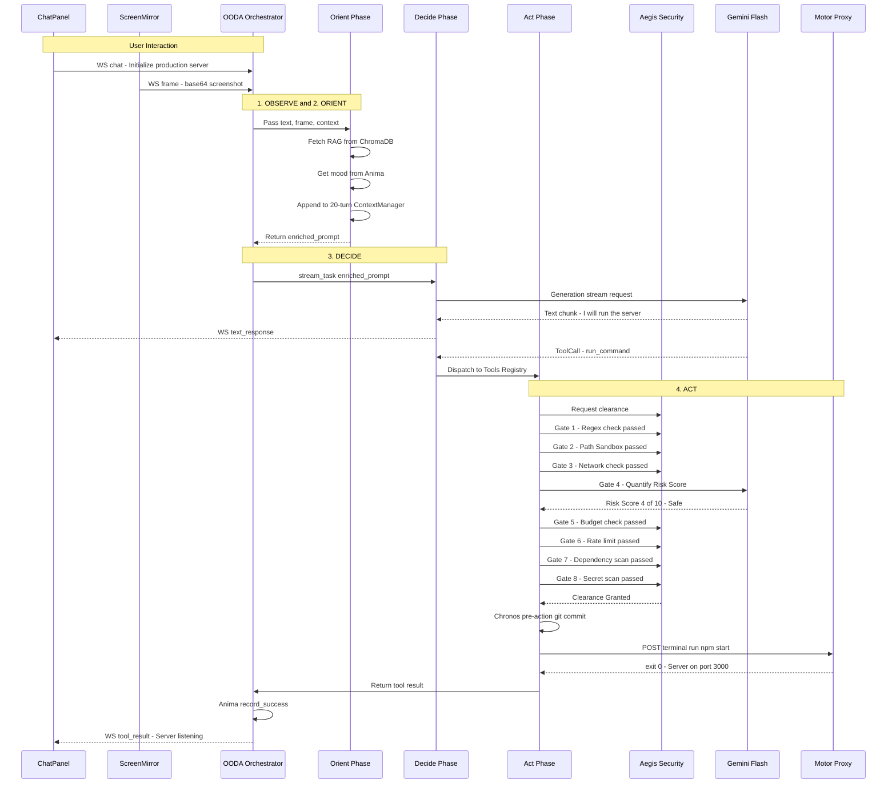

Genesis

2. Granular OODA Loop Data Sequence

```mermaid
sequenceDiagram
    participant ChatPanel
    participant ScreenMirror
    participant OODACore as OODA Orchestrator
    participant Orient as Orient Phase
    participant Decide as Decide Phase
    participant Act as Act Phase
    participant Aegis as Aegis Security
    participant Cortex as Gemini Flash
    participant Motor as Motor Proxy

    Note over ChatPanel,OODACore: User Interaction
    ChatPanel->>OODACore: WS chat - Initialize production server
    ScreenMirror->>OODACore: WS frame - base64 screenshot

    Note over OODACore,Orient: 1. OBSERVE and 2. ORIENT
    OODACore->>Orient: Pass text, frame, context
    Orient->>Orient: Fetch RAG from ChromaDB
    Orient->>Orient: Get mood from Anima
    Orient->>Orient: Append to 20-turn ContextManager
    Orient-->>OODACore: Return enriched_prompt

    Note over OODACore,Decide: 3. DECIDE
    OODACore->>Decide: stream_task enriched_prompt
    Decide->>Cortex: Generation stream request
    Cortex-->>Decide: Text chunk - I will run the server
    Decide-->>ChatPanel: WS text_response
    Cortex-->>Decide: ToolCall - run_command
    Decide->>Act: Dispatch to Tools Registry

    Note over Act,Motor: 4. ACT
    Act->>Aegis: Request clearance
    Act->>Aegis: Gate 1 - Regex check passed
    Act->>Aegis: Gate 2 - Path Sandbox passed
    Act->>Aegis: Gate 3 - Network check passed
    Act->>Cortex: Gate 4 - Quantify Risk Score
    Cortex-->>Act: Risk Score 4 of 10 - Safe
    Act->>Aegis: Gate 5 - Budget check passed
    Act->>Aegis: Gate 6 - Rate limit passed
    Act->>Aegis: Gate 7 - Dependency scan passed
    Act->>Aegis: Gate 8 - Secret scan passed
    Aegis-->>Act: Clearance Granted

    Act->>Act: Chronos pre-action git commit
    Act->>Motor: POST terminal run npm start
    Motor-->>Act: exit 0 - Server on port 3000
    Act->>OODACore: Return tool result
    OODACore->>OODACore: Anima record_success
    OODACore-->>ChatPanel: WS tool_result - Server listening
```
